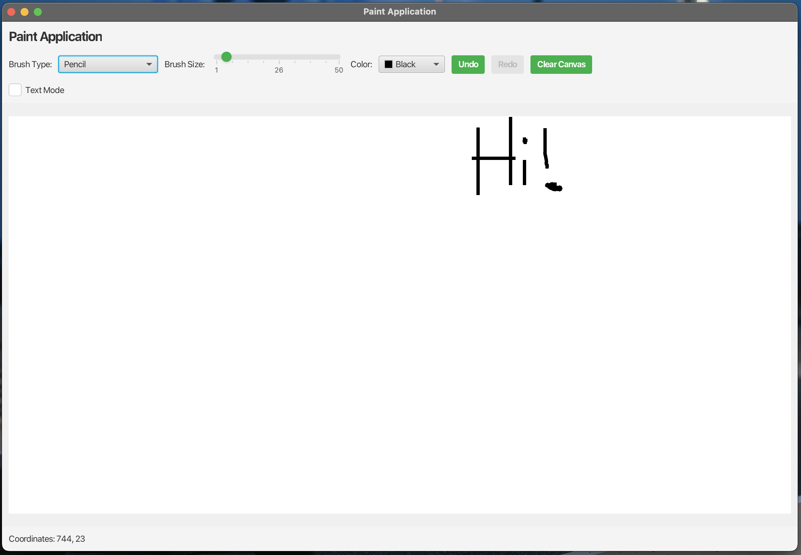

# JavaFX Paint Application

A feature-rich painting application built with JavaFX that allows users to create digital artwork with various brushes and text capabilities.



## Features

### Drawing Tools
- Multiple brush types:
  - Pencil: Free-form drawing
  - Circle: Draw circular shapes
  - Square: Draw square shapes
  - Spray: Create spray paint effect
  - Line: Draw straight lines
  - Triangle: Draw triangular shapes
  - Star: Draw star shapes
- Adjustable brush size using slider
- Color selection via color picker

### Text Tools
- Add text anywhere on the canvas
- Edit existing text with double-click
- Text formatting options:
  - Font family selection
  - Font size selection
  - Bold and italic styling
- Move text by dragging
- Text selection with visual indicators

### Canvas Operations
- Undo/Redo functionality for both drawing and text operations
- Clear canvas option
- Coordinates display
- Separate history stacks for drawing and text operations

## System Requirements

- Java 17 or higher
- JavaFX 21
- Maven for dependency management and building

## Getting Started

### Prerequisites
- JDK 17 or higher
- Maven 3.6 or higher

### Running the Application

#### Using Maven
1. Clone the repository:
   ```
   git clone https://github.com/yourusername/Paint-App.git
   cd Paint-App
   ```

2. Compile and run using Maven:
   ```
   mvn clean javafx:run
   ```

#### Using an IDE
1. Import the project as a Maven project
2. Run the `Main.java` file located in `src/main/java/org/main/paint`

## How to Use

### Drawing Mode
1. Select a brush type from the dropdown
2. Adjust brush size using the slider
3. Choose a color from the color picker
4. Draw on the canvas by clicking and dragging

### Text Mode
1. Check the "Text Mode" checkbox
2. Click anywhere on the canvas to create a new text box
3. Type your text
4. Press Enter or click elsewhere to confirm
5. Double-click existing text to edit
6. Click and drag text to move it
7. Use the text controls to change font, size, and style

### Keyboard Shortcuts
- Delete or Backspace: Remove selected text
- Undo: Ctrl+Z (not implemented yet, use button)
- Redo: Ctrl+Y (not implemented yet, use button)

## Project Structure

```
Paint-App/
├── src/
│   ├── main/
│   │   ├── java/
│   │   │   ├── module-info.java
│   │   │   └── org/
│   │   │       └── main/
│   │   │           └── paint/
│   │   │               ├── Brush.java
│   │   │               ├── Controller.java
│   │   │               ├── Main.java
│   │   │               └── TextBox.java
│   │   └── resources/
│   │       └── org/
│   │           └── main/
│   │               └── paint/
│   │                   ├── paint.fxml
│   │                   └── styles.css
└── pom.xml
```

## Development

### Adding New Brush Types
To add a new brush type:

1. Create a new class that extends `Brush` in `Brush.java`
2. Implement the `draw` method
3. Add the brush name to the `brushTypeComboBox` in the `initialize` method of `Controller.java`
4. Add a case for the new brush in the `updateBrush` method

### Future Enhancements
- Saving and loading canvas state
- Image import/export
- Selection tool
- Shape tools (rectangle, ellipse)
- Layer support
- Keyboard shortcuts

## License

This project is licensed under the MIT License - see the [LICENSE](LICENSE) file for details.

